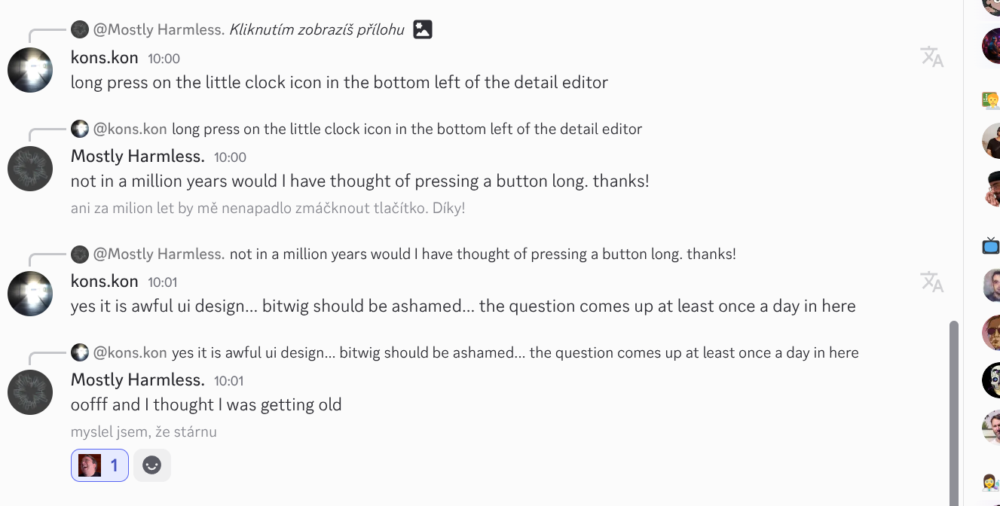

# DiMeTrans

Chrome extension for translating Discord messages into Czech.
When you click the translation icon next to a message, the message is translated.

Requires a LibreTranslate API endpoint on your infrastructure!

## Setup

1. Configure the LibreTranslate API endpoint in `content.js` (around line 100)
2. Open Chrome and go to `chrome://extensions/`
3. Enable "Developer mode"
4. Click "Load unpacked" and select the extension directory

## Features

- **Manual translation** - Clicking the translation icon next to a message translates it into Czech
- **Code preservation** - Ignores content in ``` code blocks (does not translate source code)
- **Translation cache** - Stores translations in memory for faster repeated translations
- **Edit detection** - Does not interfere with editing messages in Discord

## Requirements

- Chrome/Chromium browser
- LibreTranslate API instance (self-hosted or remote)




